# Introduction
This repository contains a Python-based AI agent designed to automate the periodic monitoring of competitors in the energy optimization sector, specifically for companies like Cubenergy, Pixii, Ampere Energy, and Ampowr. Built with LangChain, Ollama (using the Mistral LLM), and tools like DuckDuckGo for web searches, the agent gathers recent news and updates, generates structured reports (covering key updates, product developments, market strategies, threats/opportunities, and insights), and saves them to timestamped files in the `competitor-reports` directory.

# Key features
- Configurable Scheduling: Run reviews daily, weekly, or monthly using the schedule library.
- ReAct Agent Workflow: Employs a ReAct-style agent for intelligent content gathering and reasoning.
- Local LLM: Runs Mistral via Ollama for privacy and cost-efficiency.
- Sample Outputs: Check the `sample-output` folder for example reports. 

# Setup

Steps below asuume that a Python virtual environment is active. If not, install Python virtual environment and activate it. 

1. Install Dependencies: Run `pip install langchain langchain-community langchainhub duckduckgo-search ollama schedule requests`.
2. Setup Ollama: Download from https://ollama.com, then `ollama pull mistral`.
3. Execute the Script: Save as `competitor_agent.py` and run `python competitor_agent.py`. It will schedule and run reviews based on your configured periodicity.
4. Testing: Use `start_agent(60)` to run every minute for quick tests. 

# Flowcharts

```mermaid
graph TD
    A[🚀 Start Agent] --> B{Set Periodicity}
    B -->|Daily| C1[Schedule: 9:00 AM Daily]
    B -->|Weekly| C2[Schedule: Monday 9:00 AM]
    B -->|Monthly| C3[Schedule: Every 30 Days]
    B -->|Custom| C4[Schedule: Custom Seconds]
    
    C1 --> D[⏰ Scheduler Loop]
    C2 --> D
    C3 --> D
    C4 --> D
    
    D --> E[📋 Review Competitors Function]
    
    E --> F["🏢 For Each Competitor<br/>Cubenergy, Pixii, Ampere Energy, Ampowr"]
    
    F --> G["🔍 Create Search Query<br/>Recent news and updates on competitor"]
    
    G --> H[🤖 ReAct Agent Executor]
    
    H --> I["🛠️ Execute DuckDuckGo Search<br/>Gather recent content"]
    
    I --> J["📊 Process Search Results<br/>Extract relevant information"]
    
    J --> K["🧠 Send to Ollama LLM<br/>Generate structured report"]
    
    K --> L["📄 Formatted Report Generated<br/>Professional analysis ready"]
    
    L --> M["💾 Save Report to File<br/>Timestamped filename"]
    
    M --> N{More Competitors?}
    N -->|Yes| F
    N -->|No| P[✅ All Reports Complete]
    
    P --> Q["📁 Review Cycle Finished<br/>Wait for next scheduled run"]
    
    Q --> D
    
    style A fill:#e1f5fe
    style E fill:#f3e5f5
    style H fill:#fff3e0
    style K fill:#e8f5e8
    style L fill:#fce4ec
    style Q fill:#f1f8e9
```

```mermaid
graph TD
    subgraph LLMConfig ["🧠 LLM Configuration"]
        A1["Model: Mistral<br/>Local Ollama instance"]
        A2["Temperature: 0.3<br/>Consistent, focused output"]
        A3["Max Iterations: 5<br/>Robust agent execution"]
        A4["Verbose Mode: True<br/>Detailed logging"]
    end
    
    subgraph ScheduleConfig ["⏰ Scheduling Options"]
        B1["Daily: 9:00 AM<br/>Business hours execution"]
        B2["Weekly: Monday 9:00 AM<br/>Weekly competitor review"]
        B3["Monthly: Every 30 days<br/>Comprehensive analysis"]
        B4["Custom: Integer seconds<br/>Testing and flexibility"]
    end
    
    subgraph ErrorHandling ["🛡️ Error Management"]
        C1["Parsing Error Handling<br/>Graceful agent failures"]
        C2["Exception Catching<br/>Per-competitor isolation"]
        C3["Fallback Responses<br/>Error logging in reports"]
        C4["Intermediate Steps<br/>Debugging capability"]
    end
    
    subgraph CompetitorList ["🏢 Target Competitors"]
        D1[Cubenergy]
        D2[Pixii]
        D3[Ampere Energy]
        D4[Ampowr]
    end
    
    subgraph FileConfig ["📁 File Management"]
        E1["Directory: competitor-reports/<br/>Organized storage"]
        E2["Filename: report_timestamp.txt<br/>Chronological tracking"]
        E3["Auto-create directories<br/>Setup automation"]
        E4["Append mode available<br/>Continuous logging"]
    end
    
    style LLMConfig fill:#e8f5e8
    style ScheduleConfig fill:#e3f2fd
    style ErrorHandling fill:#fff3e0
    style CompetitorList fill:#f3e5f5
    style FileConfig fill:#fce4ec
```

